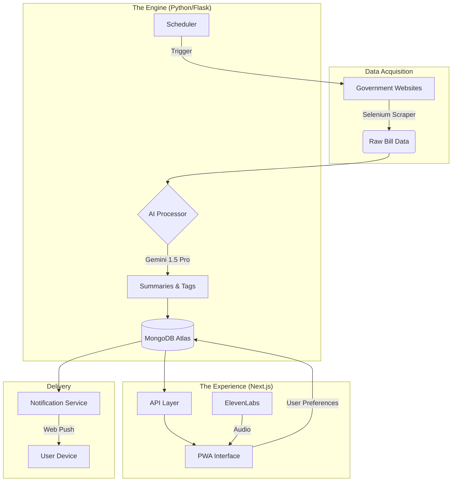

# Lega: Technical Deep Dive

## Overview

**Lega** is an intelligent Progressive Web App (PWA) designed to democratize access to legislative information. By combining real-time web scraping, AI-powered analysis, and proactive notifications, Lega delivers personalized legislative updates directly to the users who need them most.

---

## The Problem

- **Information Overload:** State legislative websites are dense and difficult to navigate.
- **Relevance Gap:** Citizens struggle to find bills that specifically impact their demographic or profession.
- **Passive Access:** Updates require active checking; there is no "push" mechanism for specific interests.

## The Solution

A **local-first, AI-driven platform** that scours legislative sources, understands the content, and proactively alerts users about bills that matter to them.

---

## System Architecture

---

## Technical Stack

### 1. Frontend Experience

Built for speed, accessibility, and fluid interaction.

- **Framework:** **Next.js 16** (App Router) with **TypeScript**.
- **Styling:** **Tailwind CSS** for a modern, responsive design system.
- **UI Components:** **Shadcn/UI** & **Lucide React**.
- **Motion:** **Framer Motion** for polished micro-interactions.
- **PWA:** Service Worker integration for offline capabilities and native-like installability.

### 2. Intelligent Backend

A robust Python pipeline ensuring data freshness and relevance.

- **Core:** **Flask** server handling API requests and orchestrating services.
- **Data store:** **MongoDB Atlas** for flexible, schema-less storage of complex bill data and user profiles.
- **Scraping:** **Selenium** (running Headless Firefox) for traversing dynamic government portals (e.g., `iga.in.gov`).
- **Scheduling:** Custom Python threading for background scraping intervals.

### 3. AI & Advanced Features

Leveraging state-of-the-art models to transform raw text into actionable insights.

- **Generative AI:** **Google Gemini Pro 1.5** via `google-generative-ai`.
  - _Role:_ Summarizes complex legal text into plain English and automatically tags bills with relevant categories (e.g., "Healthcare", "Education").
- **Audio Synthesis:** **ElevenLabs** API.
  - _Role:_ Converts bill summaries into high-quality audio for on-the-go consumption.
- **Push Notifications:** **PyWebPush** (VAPID) for secure, browser-based real-time alerts.
- **Data Sync:** **Snowflake SDK** for potential high-scale data warehousing.

---

## Key Technical Challenges Solved

### Intelligent Content Filtering

Instead of simple keyword matching, we use **Vector Embeddings / LLM Analysis** to understand the _semantic meaning_ of a bill. This ensures that a bill affecting "nursing staff ratios" is correctly routed to users interested in "Healthcare Workers," even if the specific keywords vary.

### Real-Time Pipeline

Our custom **scheduler** and **background workers** allow the system to continuously monitor legislative changes without blocking the user interface.

### Accessibility First

By integrating **ElevenLabs**, we have made legislative data accessible to users with visual impairments or those who consume information through audio.

---

## Future Roadmap

- **Expanded Jurisdiction:** Scaling the scraper architecture to support multiple states.
- **Community Features:** Direct feedback loops allowing users to comment on specific bill summaries.
- **GovTech API:** Exposing our processed data as a public API for other developers.
